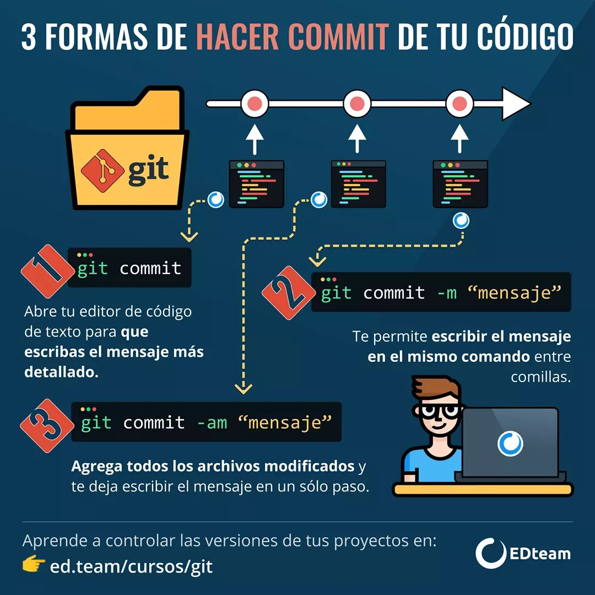

<p align="center"><a href="img/git-logo.png"></a></p>
<h1 align="center">Comandos Git</h1>


# Git
Sistema de control de versiones.


## Sistema de control de versiones (VSC)
Es un sistema que registra los cambios de uno o más archivos, con la finalidad de poder 
recuperar a futuro alguna de sus versiones.

### Repositorio Local
Son los archivos y sus respectivas versiones que se encuentran en nuestro equipo.

Posee dos partes:

- Working Directory: 
Es nuestro directorio de trabajo.

- Staging area:
Es el espacio en donde se encuentran los archivos a los que Git les debe hacer seguimiento y 
que en el algún momento se convertirán en una nueva versión del proyecto

<br><p align="center"></p><br>

### Repositorio remoto
Es nuestro repositorio en alguna plataforma de almacenanmiento de proyectos. Por ejemplo: Github, 
Gitlab, etc.


## Instalación

### En Linux:
La distribución de Kali linux viene por defecto con `git` instalado. Si alguna distribución basada 
en debian no lo tiene se debería seguir los siguientes comandos:

```
$apt-get update
$apt-get install git
```

Para verificar si la instalación fue correcta:

```
$git --version
```

Pero la versión descargada puede que sea anterior a la versión más reciente de Git. Para [descargar 
la versión más reciente de Git](https://openwebinars.net/blog/como-instalar-git-en-ubuntu/), puede 
hacerlo desde el código fuente.

##### Nota:
Kali Linux es la versión mejorada y renovada de la distro BackTrack, creada por Offensive Segurity.
La distro se basa en Debian, mientras que Backtrack se fijó en Ubuntu para la creación de su programación.

### En MAC OS X:
Si usas una versión de Mac OS X como Mavericks (10.9) o anterior a esa, puedes abrir la terminal y
escribir simplemente `git`. Si te da alguna respuesta, quiere decir que ya lo tienes instalado.

En caso no lo tengas instalado, puedes ingresar a este [link](https://git-scm.com/download/mac). Esto 
descargará un instalador al cual deberás seguir las instrucciones que te indique (muy similar a Windows
pero con muchos menos pasos).

Para verificar si la instalación fue correcta puede utilizar el comando `git --version`.

### En Windows:
Para la instalación de [Git](https://git-scm.com/) deberá descargar una herramienta llamada `Git Bash`.

#### Git Bash:
Es una herramienta de Git para el sistema de Windows, que nos permite ejecutar comandos como si 
estuviéramos en Linux o MAC OS X. El uso de Git Bash se debe a que el Command Prompt (o terminal 
de Windows) no soporta comandos UNIX.


## Configuración

Debemos establecer nuestro username y dirección de correo electrónico de nuestra cuenta de Githu, ya que
Git utilizará estos datos para la confirmación de cambios (commits).

- Configura tu nombre de usuario con el siguiente comando:

```
$ git config --global user.name miUserName
```

- Configura tu correo electrónico con el siguiente comando:

```
$ git config --global user.email miemail@domain.com
```

Para visualizar nuestra configuración podemos hacerlo con el siguiente comando:

```
$ git config --global -e
```

Para visualizar nuestra lista de configuraciones utilizemos el siguiente comando:

```
$ git config --list
```

#### Nota:
- Para Windows y MAC puedes usar la aplicación de escritotio de Github, [Github Desktop](https://desktop.github.com/) que es una Interfaz Gráfica de Usuario (GUI, por sus siglas en inglés) diseñada para facilitar el uso de Git.
- Para Linux puede usar la aplicación de escritorio [Git Kraken](https://www.gitkraken.com/), es opensource y multiplataforma.

### Comandos

- `git help`: Comando de ayuda. Te permite ver la página del manual de Git. 

     **Opciones comunes:**
     - `git help <command>`, `git <command> --help`, `man git-<command>`: Permite ver el manual del comando especificado.

- `git init`: Permite crear un nuevo repositorio de forma local. Al ejecutar este comando, se creará un nuevo subdirectorio `.git` en tu directorio de trabajo actual. También se creará una nueva rama maestra (master).`.git` contiene toda la configuración de nuestro repositorio (versiones, ramas, etc.) y además, es invisible en nuestro directorio. Para saber si está presente en nuestro directorio o no, podemos ejecutar el comando `ls -al`. 

- `git status`: Muestra los diferentes estados de los archivos de tu directorio de trabajo y área de ensayo. 

- `git checkout -- .`: Permite recuperar los archivos modificados o todo el repositorio a una versión anterior.

- `git add`: Añade contenido del directorio de trabajo al área de ensayo (staging area o 'index') para la próxima instantánea. 

  **Opciones comunes:**
    - `git add .`: Rastrea todos los archivos modificados.
    - `git add nombre_de_archivo.ext`:  Rastrea el archivo en mención.

- `git commit`: Captura una instantánea de los cambios preparados en ese momento del proyecto. Las instantáneas confirmadas pueden considerarse como versiones "seguras" de un proyecto. Antes de la ejecución de `git commit`, se utiliza el comando `git add`.

  **Opciones comunes:**
    - `git commit`: Confirma la instantánea preparada. El comando abrirá un editor de texto que te pedirá un mensaje para la confirmación. Una vez escrito el mensaje, guarda el archivo y cierra el editor para crear la confirmación.
    - `git commit -a`: Confirma una instantánea de todos los cambios del directorio de trabajo. Solo incluye modificaciones a los archivos con seguimiento.
    - `git commit -m "commit message"`: Comando de atajo que crea inmediatamente una confirmación con un mensaje de confirmación en línea. Es decir, se omitirá la solicitud de editor de texto.
    - `git commit -am "commit message"`: Combina las opciones -a y -m. Esta combinación crea inmediatamente una confirmación de todos los cambios preparados y aplica un mensaje de confirmación en línea.
    - `git commit --amend`: Permite modificar la última confirmación. En vez de crear una nueva confirmación, los cambios preparados se añadirán a la confirmación anterior. Este comando abrirá el editor de texto configurado del sistema y te pedirá que cambies el mensaje de confirmación especificado anteriormente.

<br><p align="center"></p><br>


